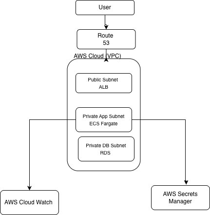

# AWS Multi-Tenant SaaS Platform Using Terraform

## Project Overview
This project is about building a multi-tenant SaaS platform using AWS and Terraform.
The goal is to understand how real-world cloud infrastructure is designed, not just creating resources.

## What is Multi-Tenants?
Multi-tenant architecture allows multiple customers(tenants) to use the same application while keeping their data isolated.

Example:
- tenant1.app.com
- tenant2.app.com

## Architecture Components
- AWS VPC (Networking)
- AWS ECS Fargate (Application Hosting)
- AWS Application Load Balancer(Traffic Routing)
- AWS RDS PostgreSQL (Database)
- AWS Route53 (DNS)
- AWS Secrets Manager (Secure Credentials)

## Architecture Flow
1. User Accesses the application using a domain
2. Route53 resolves the domain to ALB
3. ALB receives the requestes
4. ECS Process the requests
5. Application connects to the database
6. Data is stored per tenant schema

## Project Goal

- Learn Terraform from beginner level
- Understand AWS services
- Build reusable modules
- Design real-world Saas architecture

## Architecture Diagram

## Project Structure

    .
    ├── environments/
    │   └── dev/
    ├── modules/
    ├── tenant-config/
    ├── docs/
    └── README.md 

## Technologies Used

- Terraform
- AWS ECS Fargate 
- AWS RDS PostgreSQL
- AWS Application Load Balancer 
- AWS Route53

## Future Improvements

- CI/CD pipeline
- WAF integrations
- Auto Scaling

